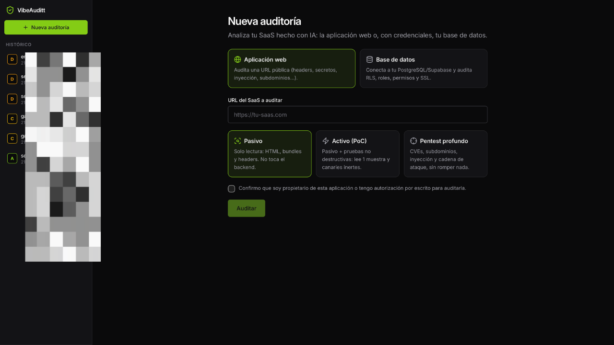
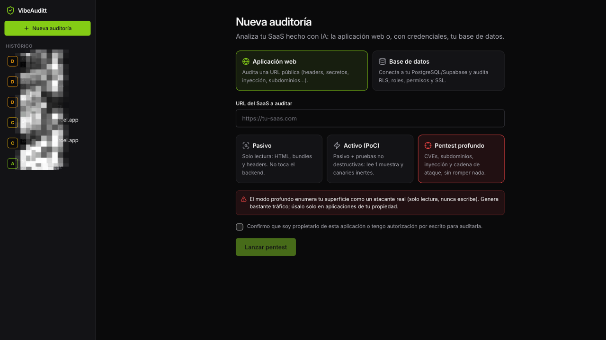
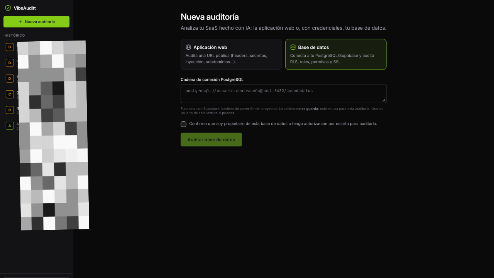

# 🛡️ VibeAuditt

**Auditor de seguridad de escritorio para SaaS hechos con IA (vibe coding)**

Detecta claves expuestas, Supabase sin RLS, CORS abierto, CVEs, inyección SQL y mucho más — sin instalar nada en tu servidor.

[**⬇️ Descargar para macOS**](../../releases/latest) · [Características](#-características) · [Cómo funciona](#-cómo-funciona)

 

---

## ¿Qué es?

Las herramientas de IA (Lovable, Bolt, v0, Cursor, Claude Code…) generan apps que **funcionan**, pero rara vez son **seguras por defecto**: claves hardcodeadas en el bundle, Supabase sin Row Level Security, CORS abierto, headers ausentes…

**VibeAuditt** es una app de escritorio para macOS que las detecta — y en modo profundo, **demuestra cómo se explotarían, sin romper nada.**

## 📸 Capturas

<table>
<tr>
<td width="50%" valign="top">

 <b>Pentest profundo</b> — CVEs, subdominios reales, inyección y cadena de ataque.
</td>
<td width="50%" valign="top">

 <b>Auditoría de base de datos</b> — conecta a tu PostgreSQL/Supabase y audita RLS, roles y permisos.
</td>
</tr>
</table>

## ✨ Características

### 🔍 Análisis web (18 checks)
- **Secretos** — Stripe, OpenAI, AWS, JWT, `service_role`… (~230 reglas, actualizables con [gitleaks](https://github.com/gitleaks/gitleaks))
- **Archivos expuestos** — `.env`, `.git`, backups SQL, configs
- **Cabeceras** — CSP, HSTS, anti-clickjacking, X-Content-Type-Options…
- **CORS** — reflejo de Origin + credenciales
- **TLS/HTTPS** — redirección, HSTS, contenido mixto
- **Supabase RLS** y **Firebase** — tablas/datos accesibles sin autenticación
- **CVEs** — librerías vulnerables cruzadas con [OSV.dev](https://osv.dev) + [CISA KEV](https://www.cisa.gov/known-exploited-vulnerabilities)
- **Tecnología/stack** — framework, servidor, WAF/CDN, backend
- **SEO/meta** — Open Graph, Twitter Card, favicons

### 🎯 Tres niveles de profundidad
| Modo | Qué hace |
|---|---|
| **Pasivo** | Solo lectura: HTML, bundles y cabeceras |
| **Activo (PoC)** | + pruebas no destructivas: lee 1 muestra, canaries inertes |
| **Pentest profundo** | + **subdominios reales** (Certificate Transparency), inyección **SQLi / SSTI / NoSQLi / comandos** no destructiva, y **cadena de ataque** narrada paso a paso |

### 🗄️ Auditoría de base de datos
Conecta a tu **PostgreSQL / Supabase** con credenciales y audita su configuración real: tablas sin RLS, roles con `SUPERUSER`/`BYPASSRLS`, permisos a `PUBLIC`, extensiones peligrosas, columnas sensibles, SSL y cifrado de contraseñas. _La cadena de conexión nunca se guarda._

### 📄 Reportes profesionales
- Puntuación 0-100 + nota **A–F** y contadores por severidad
- Cada hallazgo con **evidencia**, **PoC**, **cadena de ataque** y un **prompt listo para pegar en tu IA**
- **Exportación a PDF** profesional para presentar a clientes
- Histórico local (SQLite)

## ⬇️ Instalación

1. Descarga el `.dmg` de la [**última release**](../../releases/latest).
2. Ábrelo y arrastra **VibeAuditt** a tu carpeta de Aplicaciones.
3. Está **firmado y notarizado por Apple** → se abre sin avisos de Gatekeeper.

> **Requisitos:** macOS 11 (Big Sur) o superior · Apple Silicon.

## 🚀 Cómo funciona

1. Pega la URL pública de tu SaaS (o una cadena de conexión de base de datos).
2. Elige el modo: **pasivo**, **activo** o **pentest profundo**.
3. Confirma que es tuyo y lanza la auditoría.
4. Revisa el reporte, copia los prompts de solución y exporta el PDF.

## 🧩 Stack técnico

- **App:** [Tauri v2](https://tauri.app) (Rust) + React + TypeScript + Tailwind v4
- **Motor:** Rust — `reqwest` (rustls), `scraper`, `tokio-postgres`, `rusqlite`
- **Inteligencia en vivo:** [OSV.dev](https://osv.dev) · [CISA KEV](https://www.cisa.gov/known-exploited-vulnerabilities) · [gitleaks](https://github.com/gitleaks/gitleaks) · Certificate Transparency (crt.sh)

## ⚖️ Uso responsable

VibeAuditt está pensado para auditar **aplicaciones de tu propiedad** o con **autorización por escrito**. Los modos activo y profundo envían peticiones de prueba **siempre de solo lectura, nunca destructivas**, pero escanear sistemas de terceros sin permiso puede ser ilegal. **Tú eres responsable del uso que le des.**

## 📜 Licencia

[MIT](LICENSE)

---

Hecho con 🛡️ para que los SaaS <em>vibe-coded</em> sean un poco más seguros.

